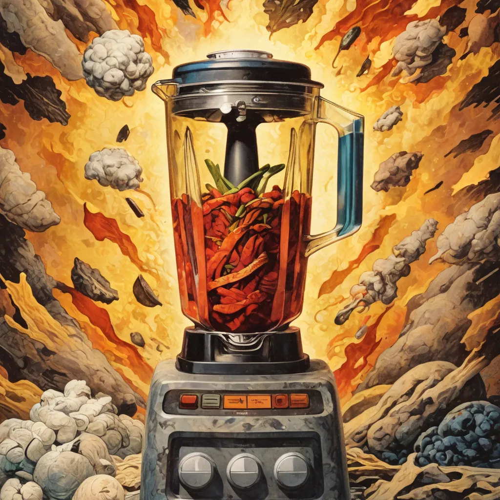

<h1 align="center">
    latent-mixer
</h1>

<p align="center">
  
</p>

<p align="center">
    A sound design tool for creation of experimental music and latent space exploration.
</p>

<p align="center">
    <a 
        href="https://opensource.org/licenses/MIT" 
        target="_blank"
        style="text-decoration: none"
    >
        
    </a>
    <a 
        href="https://twitter.com/mcaaroni" 
        target="_blank"
        style="text-decoration: none"
    >
        
    </a>
</p>

---

### Goals

My main goal for this tool is to provide a **quick and easy** way to mix 2 different samples to generate new
and **interesting** sounds.

The tool allows you to interpolate two embeddings by using a weighted average between them.
After that you can sequentially apply different transformations on the embedding (currently scaling, rotating and a nonlinear transform).

## Running

### Install deps

```sh
uv venv
source .venv/bin/activate
uv pip install -r requirements.txt
```

### Download and extract the VAE checkpoint

shoutout to lyra for the recipe ([her post on twitter](https://twitter.com/_lyraaaa_/status/1804256808900661562))

```python
from stable_audio_tools import get_pretrained_model
model, model_config = get_pretrained_model("stabilityai/stable-audio-open-1.0")
torch.save({"state_dict": model.pretransform.model.state_dict()}, "vae.ckpt")
```

### Start the backend

```sh
fastapi dev main.py
```

open the backend running at [http://localhost:8000](http://localhost:8000)

---

If you find this interesting, please consider:

- following me on [Github](https://github.com/aaronabebe)
- following me on [Twitter](https://twitter.com/mcaaroni)
